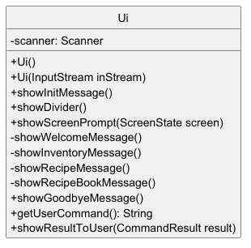
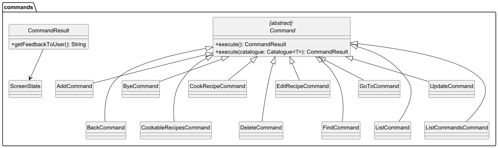
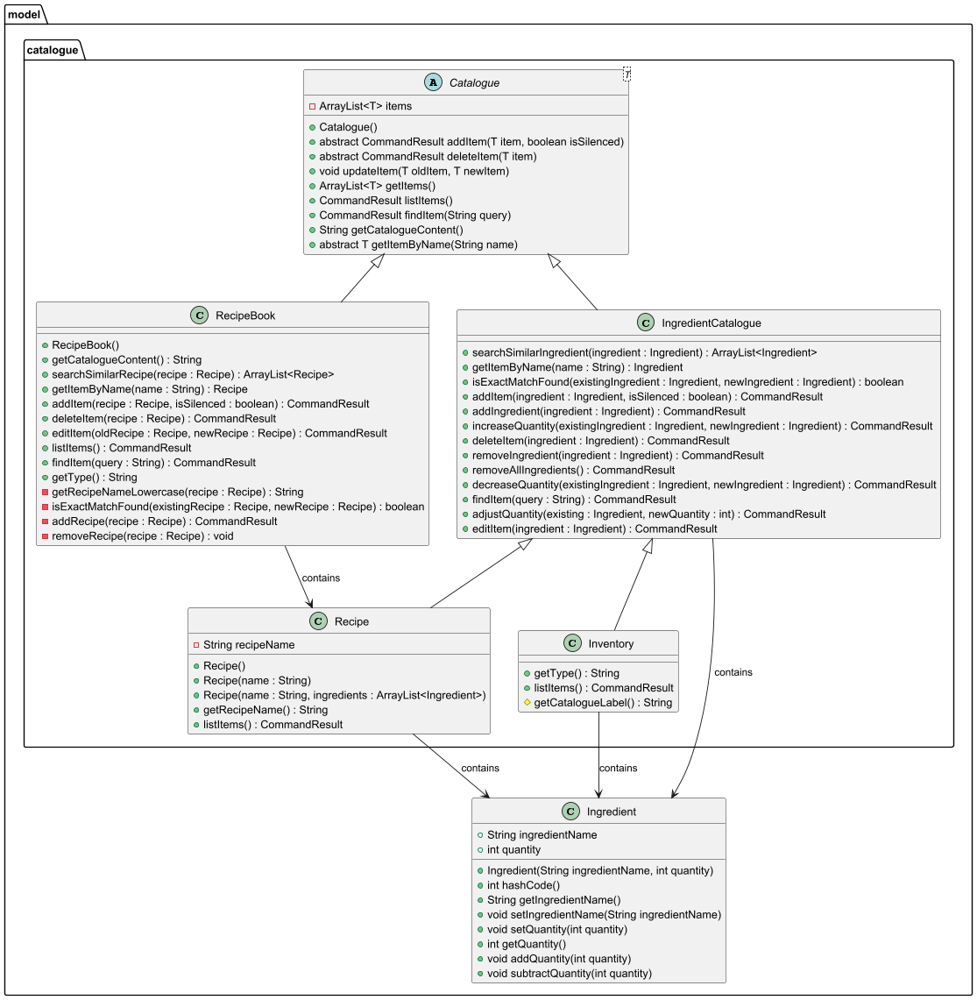
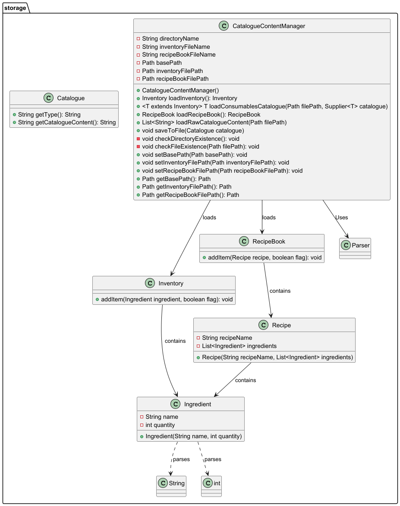

# Developer Guide

## Acknowledgements

KitchenCTRL uses the following tools for development:
1. [JUnit 5](https://junit.org/junit5/) - Used for testing
2. [Gradle](https://gradle.org/) - Used for build automation

## Design & implementation

The design and implementation of KitchenCTRL has been broken down into various sections
- [Architecture](#architecture)
- [UI Component](#ui-component)
- [Logic Component](#logic-component)
- [Model Component](#model-component)
- [Storage Component](#storage-component)
- [Common Classes](#common-classes)

### Architecture
A high-level overview of the system is shown in the Architecture Diagram below.

This architecture consists of:
1. `Ui`, `Main`, `Parser`, `InputParser` and `Command` classes: 
    These classes manage user interaction, parsing input commands, and executing actions.
2. `Ingredient`, `Recipe`, `InventoryCatalogue`, `ShoppingCatalogue`, and `RecipeCatalogue`: 
    Model objects and collections used to manage the application data.
3. `Storage` class: Stores data between sessions.
4. `Exceptions`: Handle error cases 

### UI Component

The **UI Component** of KitchenCTRL is responsible for handling all input/output interactions with the user. It manages displaying messages, prompts, and results, as well as reading user input. The UI component ensures smooth communication between the user and the application.

#### Overview

The `Ui.java` class is the core component of the UI, responsible for:
- Displaying the ASCII logo upon program startup.
- Showing screen prompts for various states (e.g., WELCOME, INVENTORY, SHOPPING, RECIPE).
- Displaying results of command executions.
- Reading user commands from the console.

This class provides methods for showing messages, reading user inputs, and displaying results after command execution. The `showScreenPrompt` method is a key method that displays the relevant help messages for each screen (e.g., inventory, shopping list, recipe).

#### Key Methods

| Method                  | Description                                                                 |
|-------------------------|-----------------------------------------------------------------------------|
| `showInitMessage`        | Displays the ASCII logo upon startup.                                       |
| `showDivider`            | Displays a divider line for separating sections in the UI.                  |
| `showScreenPrompt`       | Displays the appropriate screen prompt based on the current screen state.   |
| `showWelcomeMessage`     | Displays the welcome message and commands available on the main screen.    |
| `showInventoryMessage`   | Displays available commands for managing the inventory.                    |
| `showShoppingMessage`    | Displays available commands for managing the shopping list.                |
| `showRecipeMessage`      | Displays available commands for managing recipes.                          |
| `showGoodbyeMessage`     | Displays a goodbye message when exiting the application.                   |
| `showInvalidCommandMessage` | Displays an error message when an invalid command is entered.             |
| `getUserCommand`         | Reads and returns the user's command input.                                |
| `showResultToUser`       | Displays the result of executing a command.                                |

#### Design Considerations

The `Ui.java` class serves as the intermediary between the user and the system’s internal logic. It maintains flexibility in terms of how input/output is handled, making it easier to change the interface or port it to a different platform if necessary.

Since the application is command-line-based, `Ui.java` directly interacts with the user through standard console I/O operations. All I/O logic is contained within the UI class, ensuring that the rest of the system is decoupled from the user interface.

Additionally, the class uses a `Scanner` to read user input. If no input is provided, the program exits gracefully to avoid any exceptions. This prevents the system from crashing due to unexpected user actions.

#### Usage in the Application

The `Ui.java` class is crucial in driving the interaction between the user and the system. It integrates closely with other components such as:
- **Logic Component**: The UI displays feedback messages based on the results of executed commands that are handled by the Logic component.
- **ScreenState**: The UI uses the `ScreenState` enum to determine which screen’s prompt should be displayed (e.g., WELCOME, INVENTORY).

It allows the user to interact with the system in an intuitive way, providing clear instructions and feedback at every step.

### Logic Component

### Model Component

### Storage Component

### Common Classes

## Product scope

### Target user profile

{Describe the target user profile}

### Value proposition

{Describe the value proposition: what problem does it solve?}

## User Stories

|Version| As a ... | I want to ... | So that I can ...|
|--------|----------|---------------|------------------|
|v1.0|new user|see usage instructions|refer to them when I forget how to use the application|
|v2.0|user|find a to-do item by name|locate a to-do without having to go through the entire list|

## Non-Functional Requirements

{Give non-functional requirements}

## Glossary

* *glossary item* - Definition

## Instructions for manual testing

{Give instructions on how to do a manual product testing e.g., how to load sample data to be used for testing}
