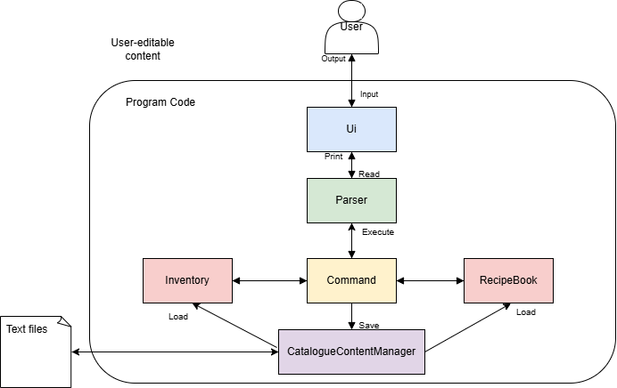
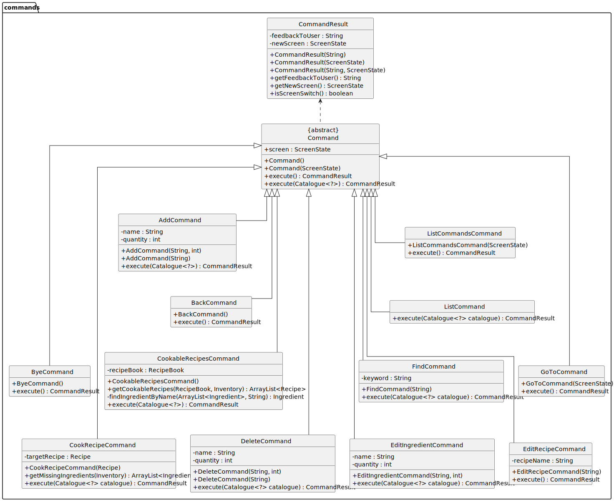
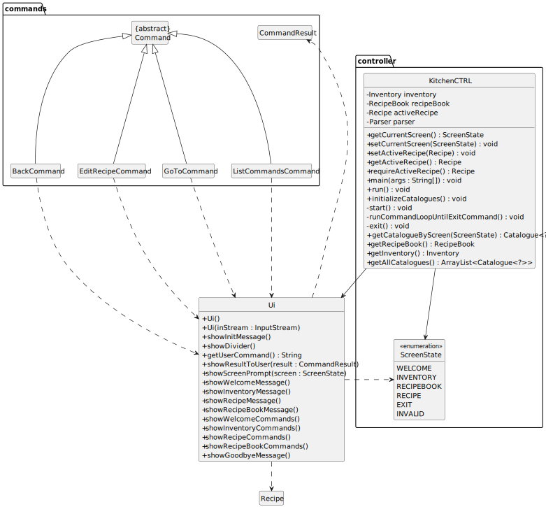
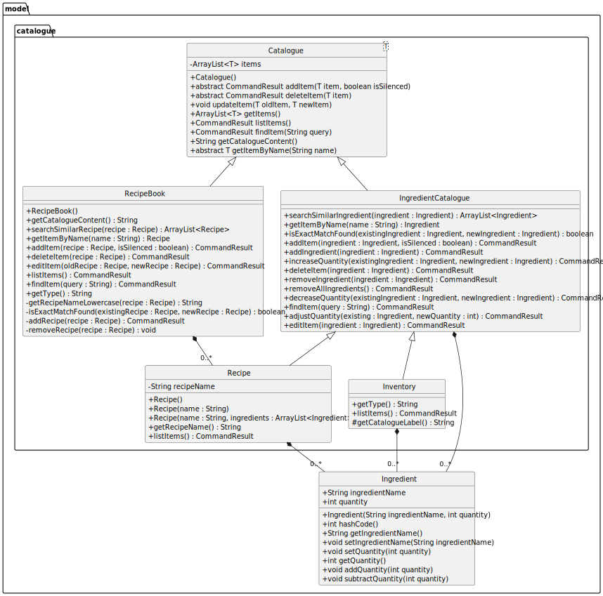
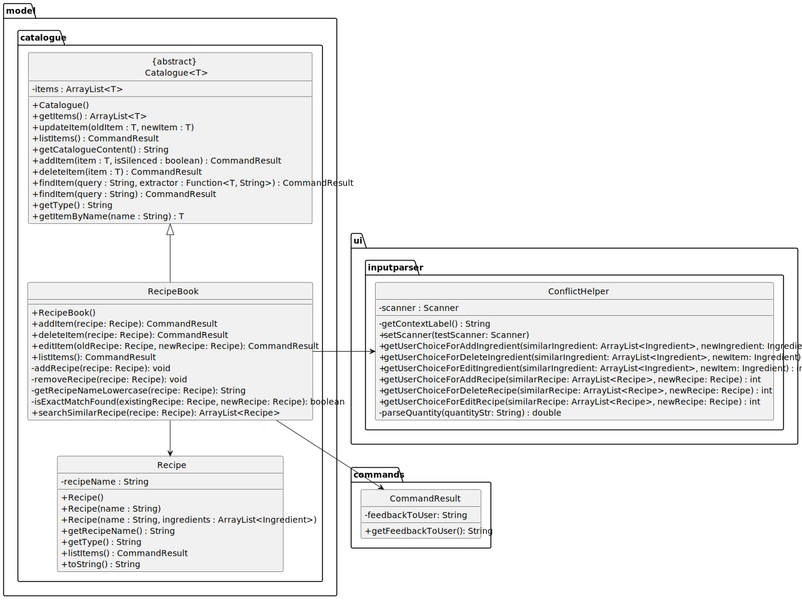
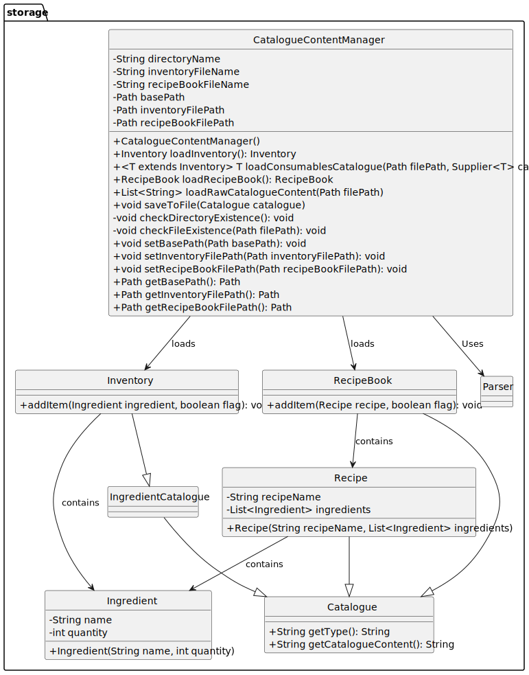

# Developer Guide

## Table of Contents

- [Acknowledgements](#acknowledgements)
- [Design & implementation](#design--implementation)
    - [Architecture](#architecture)
    - [Commands Component](#commands-component)
    - [UI Component](#ui-component)
    - [Model Component](#model-component)
    - [Storage Component](#storage-component)
- [Product scope](#product-scope)
    - [Target user profile](#target-user-profile)
    - [Value proposition](#value-proposition)
- [User Stories](#user-stories)
- [Non-Functional Requirements](#non-functional-requirements)
- [Glossary](#glossary)
- [Instructions for manual testing](#instructions-for-manual-testing)

## Acknowledgements

KitchenCTRL uses the following tools for development:
1. [JUnit 5](https://junit.org/junit5/) - Used for testing
2. [Gradle](https://gradle.org/) - Used for build automation

## Design & implementation
The design of KitchenCTRL follows a modular and layered architecture to promote separation of 
concerns and facilitate testing, debugging, and future feature expansion. 
Each component is responsible for a distinct part of the system's functionality.

The design and implementation of KitchenCTRL has been broken down into various sections
- [Architecture](#architecture)
- [Commands Component](#commands-component)
- [UI Component](#ui-component)
- [Model Component](#model-component)
- [Storage Component](#storage-component)

### Architecture
A high-level overview of the system is shown in the Architecture Diagram below.


The complete architecture consists of:
1. `Ui`, `Parser`, `Command`, `CatalogueContentManager`, `Inventory` and `RecipeBook` classes: 
    These classes manage user interaction, parsing input commands, and executing actions.
2. `Ingredient`, `Inventory`, `Recipe` and `RecipeBook` classes: 
    Model objects and collections used to manage the application data.
3. `CatalogueContentManager` class: 
    Handles loading and saving of catalogue data (e.g., inventory and recipes) to persistent storage, 
    ensuring the application state is maintained across sessions.

### Commands Component


The `commands` package encapsulates all user-triggered operations in the application. Each class in this package 
represents a specific action the user can perform, such as editing data, navigating between screens, or executing 
logic (e.g., cooking a recipe).

All commands inherit from a common abstract superclass, `Command`, which defines a consistent interface through the 
`execute()` methods. This design promotes uniformity, extensibility, and separation of concerns within the application.

#### Overview

Each command class:
- Encapsulates a **single user action or system behavior**.
- Implements one or both variants of the `execute()` method:
  - `execute()` – for screen-related or global commands.
  - `execute(Catalogue<?> catalogue)` – for commands that operate on data structures like inventory or recipe books.
- Returns a `CommandResult`, which carries output feedback and optionally a screen transition (`ScreenState`).

#### Key Features
- Encapsulation: Each command encapsulates a single operation or behavior.
- Extensibility: New commands can be added easily by extending the Command class.
- Reusability: Commands are decoupled from the UI, making them reusable across different parts of the application.
- Standardized Execution: All commands implement the execute() method, which defines the specific logic for the command.

#### Example: `CookRecipeCommand`

The `CookRecipeCommand` represents the action of cooking a selected recipe, which involves inventory updates 
and missing ingredient checks.

**Constructor**:
- Accepts the name of the recipe to cook.

**`execute(Catalogue<?> catalogue)` Method**:
- Retrieves the inventory and recipe.
- Checks if all ingredients are available.
- If so, deducts them from the inventory.
- Returns a `CommandResult` with a success message, or a failure message listing missing ingredients.

#### Summary
The commands package provides a structured way to define and execute operations in the application. 
By inheriting from the Command class, each command ensures consistency and adheres to the application's design 
principles. The CookRecipeCommand is a concrete example of how commands are implemented to perform specific tasks.

### UI Component


The **UI Component** of KitchenCTRL is responsible for handling all input/output interactions with the user.
It manages displaying messages, prompts, and results, as well as reading user input.
The UI component ensures smooth communication between the user and the application.

#### Overview

The `Ui.java` class is the core component of the UI, responsible for:
- Displaying the ASCII logo at program startup.
- Showing appropriate prompts and help messages for different screen states 
  (e.g., WELCOME, INVENTORY, RECIPEBOOK, RECIPE).
- Displaying results and feedback from command executions.

This class provides methods for showing messages, reading user inputs, and displaying results after command execution.
The `showScreenPrompt` method is a key method that displays the relevant help messages for each screen 
(e.g., inventory, recipe).

#### Key Methods

| Method                    | Description                                                                 |
|---------------------------|-----------------------------------------------------------------------------|
| `showInitMessage`         | Displays the ASCII KitchenCTRL logo at startup.                             |
| `showDivider`             | Prints a divider line to separate output sections in the console.           |
| `showScreenPrompt`        | Displays the full screen prompt and help message for the current screen.    |
| `showWelcomeMessage`      | Prints the welcome screen message and high-level available actions.         |
| `showInventoryMessage`    | Displays help and available inventory commands for the INVENTORY screen.    |
| `showRecipeMessage`       | Displays help and available commands for a specific recipe being edited.    |
| `showRecipeBookMessage`   | Displays help and available commands for the RECIPEBOOK screen.             |
| `showWelcomeCommands`     | Prints the list of commands accessible from the welcome screen.             |
| `showInventoryCommands`   | Prints the list of commands accessible from the inventory screen.           |
| `showRecipeCommands`      | Prints the list of commands accessible while editing a specific recipe.     |
| `showRecipeBookCommands`  | Prints the list of commands accessible from the recipe book screen.         |
| `showGoodbyeMessage`      | Prints a farewell message before the program exits.                         |
| `getUserCommand`          | Prompts the user and reads their next command from standard input.          |
| `showResultToUser`        | Prints the feedback message from a `CommandResult` object to the user.      |

#### Design Considerations

The `Ui.java` class serves as the intermediary between the user and the system’s internal logic.
It maintains flexibility in terms of how input/output is handled, making it easier to change the interface
or port it to a different platform if necessary.

Since the application is command-line-based, `Ui.java` directly interacts with the user through the standard console
input/output operations. All input/output logic is contained within the UI class, ensuring that the rest of the system is decoupled
from the user interface.

Additionally, the class uses a `Scanner` to read user input. If no input is provided, the program exits gracefully to
avoid any exceptions. This prevents the system from crashing due to unexpected user actions.

#### Usage in the Application

The `Ui.java` class is crucial in driving the interaction between the user and the system.
It integrates closely with other components such as:
- **Logic Component**: The UI displays feedback messages based on the results of executed commands that are
  handled by the Logic component.
- **ScreenState**: The UI uses the `ScreenState` enum to determine which screen’s prompt should be displayed
  (e.g., WELCOME, INVENTORY, RECIPE, RECIPEBOOK).

It allows the user to interact with the system in an intuitive way, providing clear instructions and feedback at every step.

### Model Component


The **Model** component stores the application's core data and implements the logic for handling recipes and ingredients.

## Overview

It contains the following key elements:
- A generic `Catalogue<T>` class that acts as a base for all data collections.
- `Inventory`, a catalogue of `Ingredient` objects.
- `Recipe`, a named list of `Ingredient` objects.
- `RecipeBook`, a catalogue of `Recipe` objects.
- `Ingredient`, a simple model representing a name–quantity pair.
- `IngredientCatalogue`, an abstract class extending `Catalogue<Ingredient>` that handles shared ingredient logic for both `Inventory` and `Recipe`.

The model exposes read-only views of stored data to other components and encapsulates logic for CRUD operations and intelligent user prompts (e.g., handling similar items).<br>
It relies on user input parsers (`InputParser`) to resolve ambiguities in add/delete scenarios.

It does **not** depend on any of the other three components (Logic, UI, or Storage), ensuring clear domain separation.

> ℹ️ **Note:** Recipes and inventory entries are internally handled using dynamic lists within `Catalogue<T>`, avoiding tight coupling and enabling code reuse across domain types.

---

## Ingredient Class

The `Ingredient` class represents a single item with a name and a quantity. It is the fundamental data type used in both the `Inventory` and `Recipe` classes.

**Attributes:**

- `ingredientName`: `String`  
  The name of the ingredient (e.g., `"Flour"`, `"Sugar"`).

- `quantity`: `int`  
  The amount of the ingredient (non-negative, capped at 99999).

**Key Methods:**
- `getIngredientName()` – Returns the name of the ingredient.
- `getQuantity()` – Returns the current quantity.
- `addQuantity(int amount)` – Increases quantity, max 99999.
- `subtractQuantity(int amount)` – Decreases quantity, never goes below 0.
- `equals(Object o)` – Compares ingredients by name (case-insensitive).
- `hashCode()` – Hash function consistent with `equals()`.
- `toString()` – Returns format like `"3x Sugar"`.

---

## IngredientCatalogue Class

The `IngredientCatalogue` is an **abstract generic class** that extends `Catalogue<Ingredient>`. It provides shared functionality for any collection that manages ingredients, such as `Inventory` and `Recipe`.

This class encapsulates logic for adding, editing, deleting, and searching ingredients, while also providing intelligent behavior like conflict resolution and quantity adjustment. It acts as the backbone for ingredient management across the application.

### Key Responsibilities
- Validate ingredient input before adding or editing.
- Match ingredients using fuzzy keyword-based search.
- Handle user prompts during ambiguous operations.
- Manage all ingredient quantity changes (increase, decrease, full removal).

### Attributes
- `items`  
  **type:** `ArrayList<Ingredient>`  
  Inherited from `Catalogue<Ingredient>`, used to store all ingredient entries.

### Key Methods

| Method | Description |
|--------|-------------|
| `addItem(Ingredient ingredient, boolean isSilenced)` | Adds a new ingredient or increases quantity if a similar one is found. Prompts user if not silenced. |
| `deleteItem(Ingredient ingredient)` | Removes or reduces quantity of an ingredient. Handles similar name cases with user interaction. |
| `editItem(Ingredient ingredient)` | Updates the quantity of an existing ingredient. Matches either exactly or via user selection. |
| `searchSimilarIngredient(Ingredient ingredient)` | Returns a list of ingredients that contain similar words to the input. |
| `getItemByName(String name)` | Retrieves an ingredient by exact name (case-insensitive). |
| `findItem(String query)` | Finds all ingredients whose names contain the keyword. |
| `removeAllIngredients()` | Clears all entries from the catalogue. |
| `increaseQuantity(...)` / `decreaseQuantity(...)` | Internal methods for adjusting quantities, respecting max/min bounds. |
| `removeIngredient(Ingredient ingredient)` | Removes an ingredient entirely from the list. |

### Design Highlights
- **Reusability:** Prevents code duplication in `Inventory` and `Recipe` by providing all shared logic.
- **User-Friendly Prompts:** Integrates with `ConflictHelper` to guide users through ambiguous add/edit/delete actions.
- **Flexible Search:** Supports keyword-based similarity rather than relying on exact matches only.
- **Defensive Programming:** Validates input ingredients for null, empty names, and invalid quantities.

> ℹ️ Used as a superclass for both `Inventory` and `Recipe`, enabling those classes to inherit complete ingredient manipulation functionality with minimal overrides.

---

## Inventory Class

The `Inventory` class is a subclass of `IngredientCatalogue`. It stores all ingredients currently available to the user.

**Attributes:**
- `items`: `ArrayList<Ingredient>` – All ingredients currently owned.
- `catalogueName`: `String` – Label for save/display (e.g., `"Inventory"`).

**Inherits Methods from `IngredientCatalogue`:**


---

## Recipe Class

The `Recipe` class represents a named list of ingredients required to make something. It also extends `IngredientCatalogue`.

**Attributes:**
- `recipeName`: `String` – Name of the recipe.
- `items`: `ArrayList<Ingredient>` – Required ingredients and quantities.

**Inherits Methods from `IngredientCatalogue`**

---

## RecipeBook Class

The `RecipeBook` is a subclass of `Catalogue<Recipe>`. It stores and manages user-created recipes.



**Attributes:**
- `items`: `ArrayList<Recipe>` – List of saved recipes.
- `catalogueName`: `String` – Label for UI and saving (e.g., `"RecipeBook"`).

**Key Methods:**
- `addItem(Recipe recipe)`
- `deleteItem(String name)`
- `getItemByName(String name)`
- `searchSimilarRecipe(Recipe recipe)`
- `editItem(String name, Recipe updatedRecipe)`
- `findItem(String keyword)`

---

### Storage Component

#### CatalogueContentManager CLass

##### Purpose

The `CatalogueContentManager` is a **utility class** responsible for handling file I/O for persistent storage of kitchen catalogues, including:

- Inventory
- RecipeBook

It ensures catalogue data is loaded from and saved to local text files.

- Files are stored in the data/ directory.

- If a file is missing or empty, defaults are used to prevent app crashes.

- Errors in file I/O are caught and passed back as user-readable messages through the Ui.

##### Responsibilities

| Method                          | Description                                                            |
|---------------------------------|------------------------------------------------------------------------|
| `loadInventory()`               | Loads inventory data from `inventory.txt` into an `Inventory` object.  |
| `loadRecipeBook()`              | Loads structured recipes from `recipe_book.txt` into a `RecipeBook`.   |
| `loadConsumablesCatalogue(...)` | Generic loader for inventory-type catalogues using a `Supplier`.       |
| `loadRawCatalogueContent(...)`  | Loads raw file lines into a list. Handles basic file existence checks. |
| `saveToFile(Catalogue)`         | Persists a given catalogue’s content back to its associated file.      |
| `checkDirectoryExistence()`     | Ensures the `data/` directory exists before read/write operations.     |
| `checkFileExistence(...)`       | Creates the necessary file if it doesn’t exist.                        |

---

##### File Format

- **Inventory Format**:
  ```
  Tomato (6)
  Onion (4)
  ```

Each item in the inventory is represented as `name (quantity)`

- **Recipe Format**:
  ```
  Tomato Soup
  Tomato (2)
  Onion (1)

  Grilled Cheese
  Bread (3)
  Cheese (5)
  ```

Each recipe ends with a **blank line**.

### Program Run Sequence

#### Command handling


User input is first captured by the `Ui.getUserCommand()` method, which is called from the `KitchenCTRL` class (not shown in the sequence diagram). The input string is then passed to the `Parser#parseCommand()` method to identify the command type and generate the appropriate `Command` object.
Once a `Command` object is created, the system invokes the `execute()` method of that command. The result of the execution is encapsulated in a `CommandResult` object, which the UI uses to print the appropriate response back to the user.
As shown in the sequence diagram, this process is demonstrated through three main scenarios:

- Navigating to the inventory screen:
The user types "inventory", which is parsed into a GoToCommand. It is executed by the system, and the UI displays "now in Inventory" to confirm the screen transition.

- Adding an ingredient:
The user enters "add egg 1", which the parser interprets as an AddCommand. During execution, the Command object interacts with the Model (in this case, Inventory) to add the ingredient "egg" with quantity 1. Once successful, a confirmation message "egg added" is returned and printed to the user.

- Exiting the program:
When the user types "bye", the parser generates a ByeCommand. This command calls CatalogueContentManager#saveAllCatalogues() internally, which saves the Inventory and RecipeBook to files using saveToFile(). After successful persistence, a "Goodbye" message is returned and shown to the user.
Each command follows a similar structure of being parsed → executed → result returned → response displayed, which is consistent with the general command handling architecture in KitchenCTRL.
This sequence diagram serves as a reference for typical command flow and will help illustrate command handling in the Architecture and Logic sections of the Developer Guide.

#### Integration

- Automatically called in `KitchenCTRL.initializeCatalogues()`.
- Automatically saves data when user exits via `ByeCommand`.

```
CatalogueContentManager contentManager = new CatalogueContentManager();
Inventory inventory = contentManager.loadInventory();
RecipeBook recipeBook = contentManager.loadRecipeBook();

contentManager.saveToFile(inventory);
```



---

## Product scope

### Target user profile

* Individuals who prefer lightweight, distraction-free tools over cluttered mobile apps
* Users comfortable typing commands in a terminal (basic command-line experience)
* People who want a quick and efficient way to track ingredients and manage recipes.

### Value proposition

KitchenCTRL solves the everyday hassle of keeping track of kitchen ingredients and meal planning.
It provides a unified, command-line interface to:

1. Track pantry inventory and prevent overbuying or waste
2. Store and manage recipes easily

Unlike traditional mobile or web apps, KitchenCTRL is fast, lightweight, and designed for keyboard-driven users who want 
maximum functionality without the clutter.

## User Stories
Priorities: High (must have) - * * *, Medium (nice to have) - * *, Low (unlikely to have) - *

| Priority | As a ...  | I want to ...                                                                                    | So that I can ...                                                |
|----------|-----------|--------------------------------------------------------------------------------------------------|------------------------------------------------------------------|
| ***      | home cook | manage individual ingredients                                                                    | easily track their quantities and usage in recipes and inventory |
| ***      | home cook | want to associate ingredients with recipes and inventory                                         | track what ingredients I have and what I need for my recipe      |
| ***      | home cook | manage my inventory by adding, deleting, and viewing items                                       | organize my cooking efficiently                                  |
| ***      | home cook | manage my recipes by adding, deleting, modifying and viewing ingredients needed                  | organize my recipes efficiently, and keep them up to date        |
| ***      | home cook | see a list of what ingredients are missing/not enough when I want to make a recipe               | replenish missing ingredients                                    |
| ***      | home cook | check if I have sufficient ingredients before cooking a recipe                                   | avoid starting to cook without everything I need                 |
| **       | home cook | manage my book of recipes by adding, deleting, modifying and viewing my recipes in my RecipeBook | organize my book of recipes efficiently                          |
| **       | home cook | view cookable recipes based on my inventory                                                      | know what recipes I can make with the ingredients I have         |
| **       | home cook | handle similar ingredients or recipes                                                            | efficiently manage variations of ingredients or recipes          |
| **       | home cook | automatically delete ingredients from inventory after cooking                                    | easily keep inventory up to date after cooking                   |
| **       | home cook | view similar recipes                                                                             | prevent overlap in recipe names                                  |
| *        | user      | save and retrieve data                                                                           | ensure my work is saved properly                                 |
| *        | home cook | receive alerts when I enter incorrect input types (e.g., text instead of numbers)                | correct mistakes and avoid errors                                |
| *        | home cook | receive a warning when I enter an unusually large number for quantity or price                   | avoid input errors                                               |
| *        | home cook | Search for existing recipe in the recipe book 	                                                  | Easily find the recipe that I currently have                     |

## Non-Functional Requirements
- The system should be able to run on Windows, macOS, and Linux.
- KitchenCTRL is able to handle large amounts of data, stored in /data/inventory.txt and /data/recipe_book.txt.
- KitchenCTRL should be easy for a new user to grasp, and allow experienced users to use different functionalities quickly.
- The program should not have offensive output messages.

## Future Plans

1. **Implement Shopping List**
   - Define the structure and functionality of the shopping list module
   - Integrate it with existing inventory and recipe features
2. **Implement Login and Set Up Database**
   - Create user authentication (login/sign-up)
   - Set up a database to persist user-specific data such as recipes, inventory, and shopping list
3. **Find Recipes with Similar Ingredients**
   - Create new functionality to find Recipes with similar ingredients instead of by Recipe name
   - Integrate with existing model for ease of integration
   
### Glossary

- **CLI (Command-Line Interface)**  
  Text-based interface where users interact by typing commands
- **UI (User Interface)**  
  Handles all user input/output interactions through the console
- **Parser**  
  Interprets raw user input and converts it into executable commands
- **Model**  
  Contains core data structures (Ingredient, Recipe) and business logic
- **Storage**  
  Manages persistent data storage through file I/O operations
- **Catalogue**  
  Generic container class for storing Inventory and RecipeBook items
- **Inventory**  
  Collection of Ingredient objects with quantities
- **Recipe**  
  Named collection of ingredients required for a dish
- **RecipeBook**  
  Catalogue containing all user-defined recipes
- **Ingredient**  
  Basic unit representing a food item with name and quantity
- **CRUD (Create, Read, Update, Delete)**  
  Fundamental data operations supported by all catalogues
- **Cookable Recipes**  
  Recipes that can be prepared with current inventory
- **ScreenState**  
  Tracks current application context (WELCOME, INVENTORY, RECIPE, RECIPEBOOK)

## Instructions for manual testing

This section guides testers through manual testing of KitchenCTRL features. To begin:
- Ensure that you have Java 17 or above installed.
- Download the latest version of KitchenCTRL from [here](https://github.com/AY2425S2-CS2113-T13-1/tp/releases).
- Open a command terminal, cd into the folder where the JAR file is and use java -jar tp.jar to run KitchenCTRL.

## Appendix: Instructions for Manual Testing

### Starting the Application

**Test case:** Start the program with `java -jar KitchenCTRL.jar`  
**Expected:** User is shown the welcome prompt and available commands.

---

### Navigating Between Screens

**Test case:** `inventory`  
**Expected:** User is taken to the Inventory screen. Message displays available inventory commands.

**Test case:** `recipe`  
**Expected:** User is taken to the RecipeBook screen. Message displays available recipe commands.

**Test case:** `back`  
**Expected:** User is taken back to the Welcome screen.

**Test case:** `bye`  
**Expected:** Program saves data and exits gracefully.

---

### Adding Items

**Test case:** `add 5 tomato` in INVENTORY  
**Expected:** Adds 5 tomatoes to inventory. Confirmation message is shown.

**Test case:** `add Pancakes` in RECIPEBOOK  
**Expected:** Adds a new recipe called Pancakes. Confirmation message is shown.

**Test case:** `add 2 milk` in RECIPE (for selected recipe)  
**Expected:** Adds 2 units of milk to the current recipe. Confirmation message is shown.

---

### Deleting Items

**Test case:** `delete 3 tomato` in INVENTORY  
**Expected:** Reduces quantity of tomato by 3. Confirmation shown.

**Test case:** `delete Pancakes` in RECIPEBOOK  
**Expected:** Removes the Pancakes recipe. Confirmation message is shown.

**Test case:** `delete 2 milk` in RECIPE  
**Expected:** Reduces milk in recipe by 2. Confirmation message is shown.

---

### Editing Items

**Test case:** `edit 10 tomato` in INVENTORY  
**Expected:** Tomato quantity is updated to 10. Confirmation shown.

**Test case:** `edit 3 milk` in RECIPE  
**Expected:** Updates quantity of milk to 3 in current recipe. Confirmation shown.

**Test case:** `edit Spaghetti` in RECIPEBOOK  
**Expected:** Enters selected recipe name if available.

---

### Finding Items

**Test case:** `find tomato` in INVENTORY  
**Expected:** Lists all inventory items with names matching "tomato".

**Test case:** `find soup` in RECIPEBOOK  
**Expected:** Lists recipes with names containing "soup".

**Test case:** `find milk` in RECIPE  
**Expected:** Lists matching ingredients in current recipe.

**Test case:** `find `  
**Expected:** Error message is shown due to empty query.

---

### Listing Items

**Test case:** `list` in INVENTORY  
**Expected:** Lists all inventory items with quantities.

**Test case:** `list` in RECIPEBOOK  
**Expected:** Lists all recipes saved.

**Test case:** `list` in RECIPE  
**Expected:** Lists ingredients in the current recipe.

---

### Cooking Recipes

**Prerequisites:** Ensure you have a recipe and sufficient ingredients in inventory.

**Test case:** `cook Pancakes`  
**Expected:** Reduces inventory items used in the recipe Pancakes. Confirmation is shown.

**Test case:** `cook Nonexistent`  
**Expected:** Error message stating recipe not found.

---

### Cookable Recipes

**Test case:** `cookable` in INVENTORY  
**Expected:** Lists all recipes that can be cooked with current inventory.

---

### Help Commands

**Test case:** `help` in any screen  
**Expected:** Displays relevant command options based on the current screen (e.g., inventory, recipe).

---

### Handling Invalid Inputs

**Test case:** `add` (missing arguments)  
**Expected:** Error indicating incorrect usage.

**Test case:** `delete banana -2`  
**Expected:** Error message for invalid quantity.

**Test case:** `cook` (no recipe name)  
**Expected:** Error message about missing arguments.

---

### Exiting

**Test case:** `bye`  
**Expected:** Saves all data (inventory and recipe book) and displays a goodbye message before exiting.

